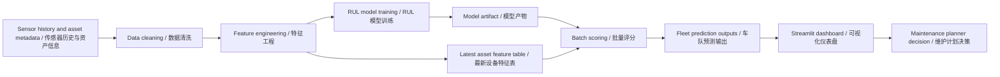

# AI Predictive Maintenance Deployment Toolkit / AI 预测性维护部署工具包

An end-to-end predictive maintenance demo that connects Remaining Useful Life (RUL) modelling with a dashboard and deployment governance. It uses CMAPSS-style equipment sensor data to estimate asset health, highlight near-term failure risk, and show how an AI maintenance solution can move from model output to operational decision support.

这是一个端到端的预测性维护项目：用类似 NASA C-MAPSS 的设备传感器数据预测 Remaining Useful Life（RUL，剩余可用寿命），识别近期故障风险，并通过 Streamlit dashboard 和部署治理文档展示模型如何落地到维护决策流程中。


## Business Problem / 业务问题

Rail, manufacturing, aviation, and utilities teams all face the same tradeoff: unplanned failures are expensive, but replacing assets too early wastes maintenance capacity and budget. A useful predictive maintenance system needs to answer three practical questions:

铁路、制造、航空和公用事业团队都面临类似问题：设备突发故障会带来停机、延误和维修成本，但过早更换设备同样浪费预算和维护资源。一个真正有价值的预测性维护系统，需要回答三个实际问题：

- Which assets are most likely to fail soon? / 哪些设备近期故障风险最高？
- How confident are we in the prediction? / 对预测结果有多大把握？
- What should planners do next? / 维护计划人员下一步应该采取什么行动？

This repo frames the problem as a Network Rail-style asset maintenance scenario. The model predicts RUL from operating cycles and sensor drift, while the dashboard turns those predictions into a prioritized intervention queue.

本项目将问题设定为类似 Network Rail 的资产维护场景：模型根据运行周期和传感器漂移趋势预测 RUL，dashboard 将预测结果转化为可排序的维护干预队列。

## Project Highlights / 项目亮点

- Data cleaning and feature engineering for engineering sensor data.
- 面向工程传感器数据的数据清洗与特征工程。
- Transparent RUL modelling with `numpy` and `pandas`, including asset-level holdout validation.
- 使用 `numpy` 和 `pandas` 构建透明的 RUL 模型，并按设备 ID 做 holdout 验证，降低数据泄漏风险。
- Streamlit dashboard for fleet health, risk mix, intervention queue, selected-asset drilldown, and validation metrics.
- Streamlit dashboard 展示设备健康状态、风险分布、维护队列、单设备详情和模型验证指标。
- Deployment artefacts covering WBS, risk register, go/no-go checklist, stakeholder map, runbook, and model card.
- 配套部署文档包括 WBS、风险登记册、Go/No-Go checklist、stakeholder map、runbook 和 model card。
- Automated tests and GitHub Actions CI.
- 包含单元测试和 GitHub Actions 自动化测试。

## Reading Path / 项目导览

If you want the business and deployment view, start with:

如果想快速理解业务价值和落地流程，可以先看：

- `docs/blog.md`
- `docs/deployment_runbook.md`
- `docs/risk_register.md`
- `docs/go_no_go_checklist.md`
- `docs/stakeholder_map.md`

If you want the technical implementation, start with:

如果想看技术实现，可以重点看：

- `src/pdm_toolkit/data.py`
- `src/pdm_toolkit/features.py`
- `src/pdm_toolkit/model.py`
- `src/pdm_toolkit/pipeline.py`
- `tests/test_pipeline.py`
- `.github/workflows/ci.yml`

## Data Source / 数据来源

The intended public benchmark is the NASA Prognostics Center of Excellence turbofan degradation dataset, commonly known as C-MAPSS. This repo does not commit NASA data directly. Instead it provides:

项目可对接的公开基准数据是 NASA Prognostics Center of Excellence 的涡扇发动机退化数据集，也就是常见的 C-MAPSS。仓库不会直接提交 NASA 数据，而是提供：

- an offline synthetic sample generator with a similar run-to-failure structure;
- 离线 synthetic sample generator，用于生成类似 run-to-failure 结构的演示数据；
- a parser for manually downloaded C-MAPSS FD001 files or ZIP archives;
- 用于处理手动下载的 C-MAPSS FD001 文件或 ZIP 压缩包的 parser；
- documented data folders for raw, external, and processed datasets.
- 清晰的数据目录说明，区分 raw、external 和 processed 数据。

For a quick demo, use the synthetic sample. For a stronger benchmark run, download NASA C-MAPSS data and run the preparation script.

快速演示可以直接使用 synthetic sample；如果要做更严谨的 benchmark，可以下载 NASA C-MAPSS 数据后运行准备脚本。

## Repository Structure / 仓库结构

```text
.
|-- app/                         # Streamlit dashboard / 仪表盘
|-- artifacts/                   # Local model artifacts / 本地生成的模型文件
|-- data/
|   |-- external/                # Public benchmark files, not committed / 外部公开数据
|   |-- processed/               # Feature tables and prediction outputs / 特征表和预测结果
|   `-- raw/                     # Generated or prepared sensor logs / 原始或生成的传感器日志
|-- deployment/                  # Docker and deployment notes / 部署说明
|-- docs/                        # PM and governance artefacts / 项目管理和治理文档
|-- examples/                    # Sample input and output files / 示例输入输出
|-- scripts/                     # CLI entry points / 命令行脚本
|-- src/pdm_toolkit/             # Data, feature, model, scoring package / 核心 Python 包
`-- tests/                       # Unit tests / 单元测试
```

## Quick Start / 快速开始

```bash
python -m venv .venv
source .venv/bin/activate  # Windows: .venv\Scripts\activate
pip install -r requirements.txt

python scripts/train_model.py --generate-sample --n-units 90
streamlit run app/streamlit_app.py
```

Run tests / 运行测试：

```bash
python -m unittest discover -s tests
```

Regenerate the dashboard preview image after training / 训练后重新生成 dashboard 预览图：

```bash
python scripts/render_dashboard_preview.py
```

The training command creates / 训练脚本会生成：

- `data/raw/sample_turbofan_sensor_log.csv`
- `data/processed/model_features.csv`
- `data/processed/evaluation_predictions.csv`
- `data/processed/fleet_latest_predictions.csv`
- `artifacts/rul_ridge_model.pkl`
- `artifacts/model_metrics.json`

## Use NASA C-MAPSS FD001 / 使用 NASA C-MAPSS FD001

Download the C-MAPSS data from NASA or another authorized mirror, place the ZIP or extracted files in `data/external/`, then run:

从 NASA 或授权镜像下载 C-MAPSS 数据，将 ZIP 或解压后的文件放到 `data/external/`，然后运行：

```bash
python scripts/prepare_cmapss_fd001.py --input data/external/CMAPSSData.zip --output data/raw/cmapss_fd001_train.csv
python scripts/train_model.py --raw-path data/raw/cmapss_fd001_train.csv
streamlit run app/streamlit_app.py
```

The parser looks for `train_FD001.txt` and converts it into this repo's standard sensor log schema.

脚本会查找 `train_FD001.txt`，并转换为本项目统一使用的传感器日志格式。

## Technical Approach / 技术方案

1. Ingest sensor history at asset-cycle level. / 按设备和运行周期读取传感器历史数据。
2. Clean missing values, enforce numeric types, and remove invalid rows. / 清洗缺失值，统一数值类型，移除无效记录。
3. Label RUL as each asset's final observed cycle minus current cycle. / 用设备最终观测周期减去当前周期，生成 RUL 标签。
4. Engineer rolling sensor means, rolling standard deviations, sensor deltas, and degradation ratios. / 构建滚动均值、滚动标准差、传感器变化量和退化比例等特征。
5. Train a ridge regression model with a holdout split by asset ID. / 按设备 ID 划分 holdout，训练 ridge regression 模型。
6. Score the latest record for each asset and assign risk tiers. / 对每个设备最新记录打分，并分配风险等级。
7. Present outputs through a Streamlit dashboard with deployment controls. / 通过 Streamlit dashboard 展示结果，并配套部署控制文档。

## Example Input and Output / 示例输入输出

Small committed examples are included for quick review:

仓库中包含小型示例文件，方便快速理解数据格式：

- `examples/sample_input.csv`
- `examples/example_fleet_output.csv`

Input rows are asset-cycle sensor observations / 输入是设备在某个运行周期的传感器观测：

```csv
unit_id,cycle,asset_class,failure_mode,setting_1,sensor_01,sensor_02
1,118,route-critical,compressor_wear,0.121,655.13,1612.42
```

Output rows are planner-facing predictions / 输出是面向维护计划的预测结果：

```csv
unit_id,cycle,predicted_rul,failure_risk,maintenance_action
1,119,22.6,high,Plan intervention in next maintenance window
```

## Model Outputs / 模型输出

- `predicted_rul`: estimated remaining operating cycles. / 预计剩余运行周期。
- `prediction_interval_low` and `prediction_interval_high`: residual-based uncertainty bounds. / 基于残差估计的不确定性区间。
- `failure_risk`: high, medium, or low based on RUL thresholds. / 基于 RUL 阈值划分的高、中、低风险。
- `maintenance_action`: recommended planning action for the asset. / 对应的维护计划建议。

## Deployment Flow / 部署流程

The deployment path is documented in `docs/deployment_runbook.md` and supported by:

部署路径记录在 `docs/deployment_runbook.md`，并由以下文档支撑：

- `docs/wbs.md`
- `docs/risk_register.md`
- `docs/go_no_go_checklist.md`
- `docs/stakeholder_map.md`
- `docs/model_card.md`

The go-live decision requires data readiness, user acceptance, model monitoring, human override paths, incident response, and rollback criteria.

正式上线前需要确认数据就绪、用户验收、模型监控、人工复核路径、事件响应和回滚标准。

## Automated Testing / 自动化测试

GitHub Actions runs on every push and pull request:

GitHub Actions 会在每次 push 和 pull request 时运行：

- install Python dependencies / 安装 Python 依赖；
- run unit tests from `tests/` / 运行 `tests/` 下的单元测试；
- build demo model artifacts from a small generated dataset / 使用小型生成数据构建 demo 模型产物。

## Architecture / 架构

The architecture diagram is also available in `docs/architecture.md`.

更完整的架构说明见 `docs/architecture.md`。



## Limitations / 局限性

- The included sample data is synthetic and should not be used for operational decisions.
- 内置样例数据是 synthetic data，不能作为真实运维决策依据。
- The ridge model is intentionally transparent; production systems may require richer sequence models and domain calibration.
- 当前 ridge 模型强调可解释和可复现，生产环境可能需要更强的序列模型和领域校准。
- RUL labels assume complete run-to-failure histories; real assets often have censored histories and maintenance resets.
- RUL 标签假设存在完整的 run-to-failure 历史，真实资产可能存在检修、更换、数据中断等情况。
- Risk thresholds must be calibrated with asset criticality, maintenance windows, safety rules, and false-alarm tolerance.
- 风险阈值需要结合资产关键性、维修窗口、安全规则和误报容忍度重新校准。
- The dashboard is decision support, not an autonomous maintenance scheduler.
- Dashboard 是决策支持工具，不是自动化维护调度系统。

See `docs/future_work.md` for a fuller roadmap.

更多后续改进见 `docs/future_work.md`。

## Technical Blog / 技术博客

A companion write-up is included in `docs/blog.md` with this structure:

配套技术博客位于 `docs/blog.md`，结构包括：

- Problem / 问题
- Why it matters / 为什么重要
- My approach / 方法
- Technical implementation / 技术实现
- Results / demo / 结果与演示
- Limitations / 局限性
- What I learned / 复盘
- GitHub link / GitHub 链接
