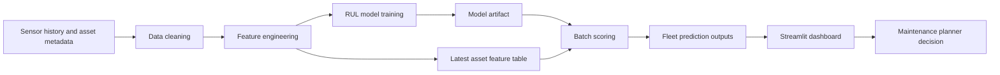

# AI Predictive Maintenance Deployment Toolkit

Portfolio project for turning predictive maintenance modelling into an operational deployment plan. The demo estimates Remaining Useful Life (RUL) and failure risk for monitored assets using CMAPSS-style sensor histories, then presents the result in a Streamlit dashboard with project management artefacts that non-coding stakeholders can understand.


## Business Problem

Rail, manufacturing, aviation, and utilities teams need to reduce unplanned failures without replacing assets too early. The practical question is not just "can the model predict failure?" but "can maintenance planners trust, deploy, and govern the prediction?"

This repo frames the problem as a Network Rail-style asset maintenance scenario:

- predict each asset's RUL from operating cycles and sensor drift;
- flag assets likely to fail within the next maintenance horizon;
- give planners a clear risk view and intervention queue;
- document the deployment controls needed before moving from pilot to live operations.

## What This Demonstrates

- Python data cleaning and feature engineering for engineering sensor data.
- A reproducible RUL model pipeline using only `numpy` and `pandas` for transparent portfolio review.
- A Streamlit dashboard for monitoring fleet health, model performance, and high-risk assets.
- Deployment artefacts: WBS, risk register, go/no-go checklist, stakeholder map, deployment runbook, and model card.
- Model-to-deployment thinking: data readiness, governance, monitoring, limitations, and handover.

## Reviewer Guide

For HR or non-technical reviewers:

- start with the screenshot above and the Business Problem section;
- read `docs/blog.md` for the project story;
- skim `docs/wbs.md`, `docs/risk_register.md`, and `docs/go_no_go_checklist.md` to see delivery thinking.

For technical interviewers:

- inspect `src/pdm_toolkit/` for data cleaning, feature engineering, modelling, and scoring;
- run `python -m unittest discover -s tests`;
- review `.github/workflows/ci.yml` for automated testing;
- read `docs/model_card.md` for validation and limitations.

## Data Source

The intended public benchmark is the NASA Prognostics Center of Excellence turbofan degradation dataset, often known as C-MAPSS. This repo does not commit NASA data. Instead it provides:

- an offline synthetic sample generator that mirrors the C-MAPSS run-to-failure structure;
- a parser for a manually downloaded C-MAPSS FD001 file or ZIP;
- clear places to drop public benchmark data under `data/external/`.

For a portfolio demo, run the synthetic sample. For a more research-grade version, download the NASA C-MAPSS data, then run the preparation script described below.

## Repository Structure

```text
.
|-- app/                         # Streamlit dashboard
|-- artifacts/                   # Trained model and metrics generated locally
|-- data/
|   |-- external/                # Public benchmark files, not committed
|   |-- processed/               # Feature tables and prediction outputs
|   `-- raw/                     # Generated or prepared sensor logs
|-- deployment/                  # Docker and deployment notes
|-- docs/                        # PM and governance artefacts
|-- examples/                    # Small sample input and output files
|-- scripts/                     # CLI entry points
|-- src/pdm_toolkit/             # Data, feature, model, scoring package
`-- tests/                       # Standard-library unit tests
```

## Quick Start

```bash
python -m venv .venv
source .venv/bin/activate  # Windows: .venv\Scripts\activate
pip install -r requirements.txt

python scripts/train_model.py --generate-sample --n-units 90
streamlit run app/streamlit_app.py
```

Run tests:

```bash
python -m unittest discover -s tests
```

Regenerate an optional PNG dashboard preview after training:

```bash
python scripts/render_dashboard_preview.py
```

The training command creates:

- `data/raw/sample_turbofan_sensor_log.csv`
- `data/processed/model_features.csv`
- `data/processed/evaluation_predictions.csv`
- `data/processed/fleet_latest_predictions.csv`
- `artifacts/rul_ridge_model.pkl`
- `artifacts/model_metrics.json`

## Use NASA C-MAPSS FD001 Instead

Download the C-MAPSS data from NASA or another authorized mirror, place the ZIP or extracted files in `data/external/`, then run:

```bash
python scripts/prepare_cmapss_fd001.py --input data/external/CMAPSSData.zip --output data/raw/cmapss_fd001_train.csv
python scripts/train_model.py --raw-path data/raw/cmapss_fd001_train.csv
streamlit run app/streamlit_app.py
```

The parser looks for `train_FD001.txt` and converts it into this repo's standard sensor log schema.

## Technical Approach

1. **Ingest** sensor history at asset-cycle grain.
2. **Clean** missing values, enforce numeric types, and remove invalid rows.
3. **Label** RUL as each asset's final observed cycle minus current cycle.
4. **Engineer features** using rolling sensor means, rolling standard deviations, sensor deltas, and simple degradation ratios.
5. **Train** a ridge regression RUL model with a holdout split by asset ID to reduce leakage.
6. **Score** the latest record for each asset and assign risk tiers.
7. **Deploy** through a Streamlit dashboard backed by explicit go/no-go and monitoring controls.

## Example Input and Output

Small committed examples are included for quick review:

- `examples/sample_input.csv`
- `examples/example_fleet_output.csv`

Input rows are asset-cycle sensor observations:

```csv
unit_id,cycle,asset_class,failure_mode,setting_1,sensor_01,sensor_02
1,118,route-critical,compressor_wear,0.121,655.13,1612.42
```

Output rows are planner-facing predictions:

```csv
unit_id,cycle,predicted_rul,failure_risk,maintenance_action
1,119,22.6,high,Plan intervention in next maintenance window
```

## Model Outputs

- `predicted_rul`: estimated remaining operating cycles.
- `prediction_interval_low` and `prediction_interval_high`: simple residual-based uncertainty bounds.
- `failure_risk`: high, medium, or low based on RUL thresholds.
- `maintenance_action`: recommended planning action for the asset.

## Deployment Flow

The deployment path is documented in `docs/deployment_runbook.md` and governed by:

- `docs/wbs.md`
- `docs/risk_register.md`
- `docs/go_no_go_checklist.md`
- `docs/stakeholder_map.md`
- `docs/model_card.md`

The go-live decision requires data readiness, user acceptance, model monitoring, human override paths, incident response, and rollback criteria.

## Automated Testing

GitHub Actions runs on every push and pull request:

- installs Python dependencies;
- runs standard-library unit tests from `tests/`;
- builds demo model artifacts from a small generated dataset.

## Architecture

The architecture diagram is available in `docs/architecture.md` and renders on GitHub through Mermaid.



## Limitations

- The included sample data is synthetic and should not be used for operational decisions.
- A simple ridge model is intentionally transparent; production systems may require richer sequence models and domain calibration.
- RUL labels assume complete run-to-failure history; live rail assets often have censored histories and maintenance resets.
- Risk thresholds must be calibrated with asset criticality, maintenance windows, safety rules, and false-alarm tolerance.
- The dashboard is a decision-support demo, not an autonomous maintenance scheduler.

See `docs/future_work.md` for a fuller limitations and roadmap section.

## Technical Blog

A companion write-up is included in `docs/blog.md` with this structure:

- Problem
- Why it matters
- My approach
- Technical implementation
- Results / demo
- Limitations
- What I learned
- GitHub link placeholder

## Suggested GitHub Description

`Predictive maintenance portfolio project with RUL modelling, Streamlit fleet dashboard, and deployment governance artefacts.`

## Suggested Resume Bullet

Built an AI predictive maintenance deployment toolkit using CMAPSS-style sensor data, Python feature engineering, RUL modelling, a Streamlit dashboard, and delivery artefacts including WBS, risk register, go/no-go checklist, stakeholder map, and deployment runbook.
