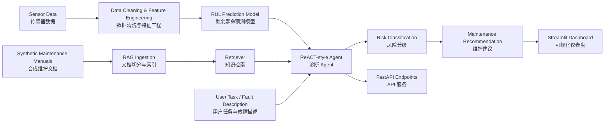

# AI Predictive Maintenance Agent

FastAPI + RAG + ReACT-style Agent system for industrial equipment fault diagnosis, Remaining Useful Life (RUL) prediction, and maintenance decision support.

面向工业设备故障诊断和维护决策支持的 AI 应用：结合 FastAPI、RAG、ReACT-style Agent、传感器数据分析和 RUL 预测。

中文版本: [README.zh-CN.md](README.zh-CN.md)


## Project Overview / 项目概览

This project demonstrates how a predictive maintenance workflow can move from sensor data and maintenance documents to actionable maintenance recommendations. The deployment scenario is framed as a Network Rail-style 36-week pilot covering 100 railway infrastructure assets.

The system can:

- analyse equipment sensor readings;
- predict Remaining Useful Life (RUL);
- retrieve relevant maintenance knowledge from synthetic demo manuals, fault case notes, and project delivery documents;
- classify operational risk as `Low`, `Medium`, `High`, or `Unknown`;
- generate a structured maintenance recommendation through a ReACT-style Agent workflow;
- expose the workflow through a FastAPI backend and a Streamlit dashboard.

本项目展示一个预测性维护 AI 系统如何从传感器数据和维护文档出发，生成可解释的维护建议。部署场景设定为类似 Network Rail 的 36 周试点，覆盖 100 个铁路基础设施资产。系统支持传感器异常分析、RUL 预测、RAG 文档检索、风险分级和结构化维护报告。

## Why It Matters / 项目价值

Industrial teams often need to decide whether to continue operating equipment, inspect it, or intervene before failure. A useful AI maintenance system must connect model outputs with operational context:

- maintenance planners need clear next actions, not only model scores;
- engineers need traceable evidence from manuals and sensor data;
- managers need transparent risk, limitations, and deployment readiness;
- AI teams need evaluation checks before treating generated recommendations as reliable.

工业场景中，模型分数本身不够。维护团队更需要可解释证据、风险等级、下一步行动和局限性说明。本项目强调从模型到可落地 AI 应用的完整链路。

## Architecture / 架构



## Features / 功能

- **RUL prediction**: trains and uses a transparent predictive maintenance model from CMAPSS-style time-series sensor data.
- **Sensor analysis**: detects abnormal temperature, vibration, current, and sensor drift patterns.
- **Time-series feature modelling**: builds rolling means, rolling standard deviations, deltas, and degradation ratios before RUL prediction.
- **RAG knowledge base**: retrieves maintenance context from maintenance guides, fault case notes, and delivery governance documents in `data/manuals/`.
- **ReACT-style Agent**: records reasoning, action, observation, and final answer steps.
- **FastAPI backend**: provides `/health`, `/rag/query`, and `/agent/run` endpoints.
- **Evaluation module**: checks RAG and Agent outputs using transparent rule-based tests.
- **Deployment documentation**: includes 36-week pilot plan, 100-asset scope, budget, WBS, risk register, communication plan, go/no-go checklist, stakeholder map, runbook, and model card.
- **Portfolio-ready presentation**: includes architecture, examples, limitations, future work, tests, and GitHub Actions CI.

## Tech Stack / 技术栈

- **Python**: core application language
- **FastAPI + Pydantic**: API service and request/response schemas
- **Streamlit**: dashboard and business-facing demo
- **pandas + numpy**: data cleaning, feature engineering, and modelling
- **Local sparse vector retrieval**: lightweight TF-IDF style RAG index, replaceable with FAISS/Chroma/LLM embeddings
- **unittest**: automated tests
- **GitHub Actions**: CI workflow

## Repository Structure / 目录结构

```text
.
|-- app/
|   |-- agent/                 # ReACT-style Agent workflow and tools
|   |-- evaluation/            # RAG and Agent evaluation scripts
|   |-- rag/                   # RAG ingestion, retrieval, and prompts
|   |-- main.py                # FastAPI backend
|   `-- streamlit_app.py       # Streamlit dashboard
|-- data/
|   |-- manuals/               # Synthetic demo manuals, fault cases, and delivery documents
|   |-- raw/                   # Generated or prepared sensor logs
|   `-- processed/             # Feature tables and predictions
|-- docs/                      # Deployment and project governance documents
|-- scripts/                   # Training and data preparation scripts
|-- src/pdm_toolkit/           # Predictive maintenance package
`-- tests/                     # Unit tests
```

## Install and Run / 安装与运行

```bash
python -m venv .venv
source .venv/bin/activate  # Windows: .venv\Scripts\activate
pip install -r requirements.txt
```

Train or regenerate demo model artifacts:

```bash
python scripts/train_model.py --generate-sample --n-units 90
```

Build the RAG index:

```bash
python app/rag/ingest.py
```

Start the FastAPI backend:

```bash
uvicorn app.main:app --reload
```

Start the Streamlit dashboard:

```bash
streamlit run app/streamlit_app.py
```

Run tests:

```bash
python -m unittest discover -s tests
```

## API Examples / API 示例

Health check:

```bash
curl http://127.0.0.1:8000/health
```

Expected response:

```json
{"status":"ok"}
```

## RAG Example / RAG 示例

Query the maintenance knowledge base:

```bash
curl -X POST http://127.0.0.1:8000/rag/query \
  -H "Content-Type: application/json" \
  -d "{\"question\":\"What should I check if the motor temperature rises abnormally?\"}"
```

The response includes:

```json
{
  "direct_answer": "Check whether the temperature reading is valid...",
  "supporting_evidence": [
    {
      "source": "motor_overheating_guide.md",
      "score": 0.42,
      "text": "..."
    }
  ],
  "source_documents": ["motor_overheating_guide.md"],
  "uncertainty_note": "Retrieved evidence is relevant for demo decision support..."
}
```

The documents in `data/manuals/` are synthetic demo documents, not real OEM manuals. They are included to demonstrate the RAG workflow without claiming access to proprietary maintenance manuals.

`data/manuals/` 中的文档是 synthetic demo documents，用于演示 RAG 流程，不代表真实 OEM 手册。

## Agent Example / Agent 示例

Run the predictive maintenance Agent:

```bash
curl -X POST http://127.0.0.1:8000/agent/run \
  -H "Content-Type: application/json" \
  -d "{\"asset_id\":42,\"user_task\":\"Diagnose abnormal motor temperature and recommend next action\",\"fault_description\":\"Motor temperature is rising and vibration alarm triggered.\",\"sensor_readings\":{\"cycle\":140,\"temperature\":92,\"vibration\":8.2,\"current\":132,\"asset_class\":\"route-critical\"}}"
```

The response includes:

```json
{
  "task_interpretation": "Assess asset 42...",
  "tools_used": [
    "retrieve_manual_knowledge",
    "analyse_sensor_data",
    "predict_rul",
    "classify_risk",
    "generate_maintenance_report"
  ],
  "rul_estimate": {
    "predicted_rul": 24.5,
    "model_source": "artifacts/rul_ridge_model.pkl"
  },
  "risk_level": "High",
  "recommended_next_action": "Plan inspection or intervention in the next safe maintenance window.",
  "limitations": [
    "Agent output is decision support only and does not replace OEM manuals or safety procedures."
  ]
}
```

The Agent maps to ReACT in a practical way:

- **Reasoning**: interpret the task and decide which information is needed.
- **Action**: call retrieval, sensor analysis, RUL prediction, risk classification, or reporting tools.
- **Observation**: store each tool result.
- **Final answer**: combine evidence, RUL, risk, and limitations into a recommendation.

## Evaluation / 评估

The evaluation module uses 20 synthetic but realistic predictive maintenance questions in `app/evaluation/test_questions.json`.

Run RAG evaluation:

```bash
python app/evaluation/evaluate_rag.py
```

Run Agent evaluation:

```bash
python app/evaluation/evaluate_agent.py
```

Optionally save results:

```bash
python app/evaluation/evaluate_rag.py --save
python app/evaluation/evaluate_agent.py --save
```

Evaluation checks:

- whether RAG answers include source documents;
- whether retrieved context is non-empty;
- whether Agent risk levels are valid;
- whether the Agent selected relevant tools;
- whether the output includes a recommended next action;
- whether the system admits uncertainty when evidence is insufficient.

Sample local results:

| Evaluation suite | Test cases | Passed | Pass rate |
|---|---:|---:|---:|
| RAG evaluation | 20 | 20 | 100% |
| Agent evaluation | 20 | 20 | 100% |

These checks are intentionally lightweight and transparent. They are not a substitute for expert review, live plant validation, or production safety testing.

## Screenshots / 截图

Dashboard preview:


FastAPI interactive docs are available after starting the backend:

```text
http://127.0.0.1:8000/docs
```

## Limitations / 局限性

- The sensor data and maintenance manuals included in this repo are synthetic demo assets.
- The RUL model is intentionally transparent and lightweight; production systems may require richer sequence models and calibration.
- Time-series modelling is implemented through rolling-window feature engineering rather than an LSTM/Transformer sequence model.
- The local RAG retriever is designed for reproducibility, not maximum retrieval performance.
- The Agent is deterministic and maintainable, but does not use an external orchestration framework.
- Recommendations are decision support only and do not replace OEM manuals, safety procedures, or qualified engineering judgement.
- Risk thresholds should be calibrated with asset criticality, maintenance windows, failure costs, and false-alarm tolerance.

## Future Improvements / 后续改进

- Replace the local sparse retriever with FAISS or Chroma.
- Add optional OpenAI or local LLM integration through environment variables.
- Add richer RAG metrics such as retrieval precision, groundedness, and answer relevance.
- Add time-series models for RUL prediction, such as LSTM, Temporal CNN, or transformer-based models.
- Add authentication, request logging, model monitoring, and feedback capture.
- Add Docker deployment and cloud deployment examples.
- Add a demo GIF showing the full API and dashboard workflow.

## AI Development Engineer Skill Mapping / 能力映射

This project demonstrates the following AI Development Engineer skills:

| Skill area | How it appears in this project |
|---|---|
| RAG | Ingests maintenance documents, chunks text, builds a local index, retrieves evidence, and returns source documents. |
| Prompt Engineering | Uses structured RAG and Agent prompt templates with direct answer, evidence, sources, and uncertainty. |
| ReACT Agent | Implements reasoning, action, observation, and final-answer steps without unnecessary orchestration complexity. |
| FastAPI | Exposes production-style API endpoints with typed request and response schemas. |
| Predictive modelling | Preserves RUL prediction from engineering sensor data. |
| Model and system evaluation | Provides transparent RAG and Agent evaluation scripts with reproducible test questions. |
| Production-oriented AI application | Includes limitations, deployment governance documents, risk controls, tests, and CI. |

## Supporting Documents / 配套文档

- `docs/blog.md`
- `docs/architecture.md`
- `docs/pilot_deployment_plan.md`
- `docs/deployment_runbook.md`
- `docs/risk_register.md`
- `docs/go_no_go_checklist.md`
- `docs/stakeholder_map.md`
- `docs/model_card.md`
- `docs/future_work.md`
