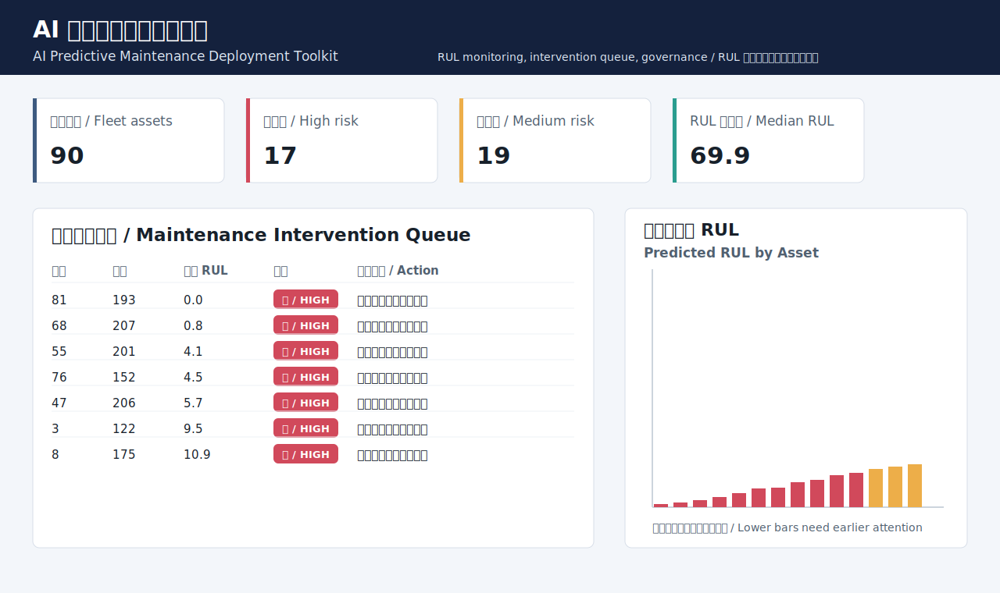
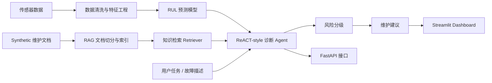

# AI 预测性维护 Agent

一个面向工业设备故障诊断和维护决策支持的 AI 应用，结合 **FastAPI + RAG + ReACT-style Agent + RUL 预测模型**。



## 项目概览

本项目展示一个预测性维护系统如何从设备传感器数据和维护文档出发，生成可解释的维护建议。

系统可以完成：

- 分析设备传感器读数；
- 预测 Remaining Useful Life（RUL，剩余可用寿命）；
- 从 synthetic demo 维护手册中检索相关知识；
- 将设备风险分为 `Low`、`Medium`、`High` 或 `Unknown`；
- 使用 ReACT-style Agent 工作流生成结构化维护建议；
- 通过 FastAPI 提供 API，并通过 Streamlit 展示 dashboard。

## 为什么这个项目有价值

工业设备维护场景中，团队需要判断设备是否可以继续运行、是否需要检查、是否应该提前干预。单纯的模型分数不够，真正有价值的 AI 系统需要把模型输出、传感器数据、维护手册和业务限制连接起来。

这个项目强调：

- 维护计划人员需要清晰的下一步行动，而不仅是预测分数；
- 工程人员需要能追溯的证据，例如传感器异常和文档来源；
- 管理人员需要了解风险、局限性和部署准备情况；
- AI 团队需要在使用生成式建议前做基础评估。

## 架构



## 核心功能

- **RUL 预测**：使用类似 C-MAPSS 的传感器数据训练透明的预测性维护模型。
- **传感器分析**：识别温度、振动、电流和传感器漂移等异常模式。
- **RAG 知识库**：从 `data/manuals/` 中的维护文档检索证据。
- **ReACT-style Agent**：显式记录 reasoning、action、observation 和 final answer。
- **FastAPI 后端**：提供 `/health`、`/rag/query` 和 `/agent/run` 接口。
- **评估模块**：用透明的规则检查 RAG 和 Agent 输出质量。
- **部署治理文档**：包含 WBS、risk register、go/no-go checklist、stakeholder map、runbook 和 model card。

## 技术栈

- Python
- FastAPI + Pydantic
- Streamlit
- pandas + numpy
- 本地 sparse vector retrieval，可后续替换为 FAISS、Chroma 或 embedding 模型
- unittest
- GitHub Actions

## 安装与运行

```bash
python -m venv .venv
source .venv/bin/activate  # Windows: .venv\Scripts\activate
pip install -r requirements.txt
```

生成 demo 模型产物：

```bash
python scripts/train_model.py --generate-sample --n-units 90
```

构建 RAG 索引：

```bash
python app/rag/ingest.py
```

启动 FastAPI：

```bash
uvicorn app.main:app --reload
```

启动 Streamlit：

```bash
streamlit run app/streamlit_app.py
```

运行测试：

```bash
python -m unittest discover -s tests
```

## API 示例

健康检查：

```bash
curl http://127.0.0.1:8000/health
```

返回：

```json
{"status":"ok"}
```

## RAG 示例

```bash
curl -X POST http://127.0.0.1:8000/rag/query \
  -H "Content-Type: application/json" \
  -d "{\"question\":\"What should I check if the motor temperature rises abnormally?\"}"
```

返回内容包括：

- 直接回答；
- supporting evidence；
- source document names；
- uncertainty note。

`data/manuals/` 中的文档是 synthetic demo documents，不是真实 OEM 手册。这样可以展示 RAG 流程，同时避免暗示项目使用了真实专有维护资料。

## Agent 示例

```bash
curl -X POST http://127.0.0.1:8000/agent/run \
  -H "Content-Type: application/json" \
  -d "{\"asset_id\":42,\"user_task\":\"Diagnose abnormal motor temperature and recommend next action\",\"fault_description\":\"Motor temperature is rising and vibration alarm triggered.\",\"sensor_readings\":{\"cycle\":140,\"temperature\":92,\"vibration\":8.2,\"current\":132,\"asset_class\":\"route-critical\"}}"
```

Agent 返回内容包括：

- 任务理解；
- 使用过的工具；
- RAG 检索证据；
- RUL 预测结果；
- 风险等级；
- 推荐下一步行动；
- 局限性说明。

## 评估方法

项目包含 20 个 synthetic 但贴近真实场景的预测性维护问题，位于：

```text
app/evaluation/test_questions.json
```

运行 RAG 评估：

```bash
python app/evaluation/evaluate_rag.py
```

运行 Agent 评估：

```bash
python app/evaluation/evaluate_agent.py
```

评估检查包括：

- RAG 回答是否包含来源文档；
- 检索上下文是否非空；
- Agent 风险等级是否合法；
- Agent 是否选择了相关工具；
- 输出是否包含推荐下一步行动；
- 当证据不足时，系统是否承认不确定性。

本地样例结果：

| 评估模块 | 测试数量 | 通过数量 | 通过率 |
|---|---:|---:|---:|
| RAG evaluation | 20 | 20 | 100% |
| Agent evaluation | 20 | 20 | 100% |

## 截图

Dashboard preview:


FastAPI 文档页面：

```text
http://127.0.0.1:8000/docs
```

## 局限性

- 项目中的传感器数据和维护文档都是 synthetic demo assets。
- RUL 模型刻意保持轻量和透明，生产环境可能需要更复杂的时间序列模型。
- 当前 RAG retriever 以可复现为主，不追求最高检索性能。
- Agent 是可维护的 deterministic workflow，没有使用复杂外部编排框架。
- 输出是决策支持，不替代 OEM 手册、安全流程或专业工程判断。
- 风险阈值需要结合资产关键性、维护窗口、故障成本和误报容忍度校准。

## 后续改进

- 将本地 sparse retriever 替换为 FAISS 或 Chroma。
- 增加 OpenAI 或本地 LLM 接口，并通过环境变量配置。
- 增加 retrieval precision、groundedness、answer relevance 等 RAG 指标。
- 增加 LSTM、Temporal CNN 或 Transformer 类 RUL 模型。
- 增加认证、日志、模型监控和用户反馈闭环。
- 增加 Docker 和云部署示例。
- 增加 demo GIF 展示完整 API 与 dashboard 流程。

## 对应 AI Development Engineer 能力

| 能力方向 | 项目体现 |
|---|---|
| RAG | 文档切分、索引构建、证据检索、来源文档返回。 |
| Prompt Engineering | 使用结构化 RAG 和 Agent prompt template。 |
| ReACT Agent | 实现 reasoning、action、observation、final answer 流程。 |
| FastAPI | 提供生产风格 API endpoint 和 typed schema。 |
| 预测建模 | 保留传感器数据 RUL 预测逻辑。 |
| 模型与系统评估 | 提供可复现的 RAG 和 Agent 评估脚本。 |
| 工程化 AI 应用 | 包含测试、CI、局限性、部署治理和风险控制。 |

## 配套文档

- `docs/blog.md`
- `docs/architecture.md`
- `docs/deployment_runbook.md`
- `docs/risk_register.md`
- `docs/go_no_go_checklist.md`
- `docs/stakeholder_map.md`
- `docs/model_card.md`
- `docs/future_work.md`
