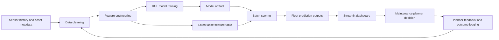

# Architecture

## Design Choices

- Batch scoring is used because maintenance planning usually works on scheduled refreshes, not millisecond inference.
- The dashboard reads approved scoring outputs rather than querying raw operational systems directly.
- The model is deliberately simple and transparent for portfolio review and stakeholder explanation.
- Governance artefacts are versioned beside code so deployment thinking is visible, not hidden in slide decks.
