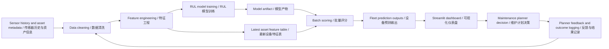

# Architecture / 架构

This project separates model development, batch scoring, dashboard consumption, and operational feedback. The goal is to keep the model pipeline reproducible while making the dashboard simple for maintenance planning.

本项目将模型开发、批量评分、dashboard 展示和运维反馈拆开处理。这样既能保证模型 pipeline 可复现，也能让 dashboard 更专注于维护计划决策。

## Design Choices / 设计选择

- Batch scoring is used because maintenance planning usually works on scheduled refreshes, not millisecond inference.
- 使用 batch scoring，因为维护计划通常按固定刷新周期工作，而不是毫秒级实时推理。
- The dashboard reads approved scoring outputs rather than querying raw operational systems directly.
- Dashboard 读取经过批准的评分输出，不直接查询原始生产系统。
- The model is deliberately simple and transparent so assumptions, metrics, and limitations are easy to inspect.
- 模型故意保持简单透明，方便检查假设、指标和局限性。
- Governance artefacts are versioned beside code so deployment thinking is visible and auditable.
- 治理文档和代码一起版本化，让部署思路可见、可审计。
